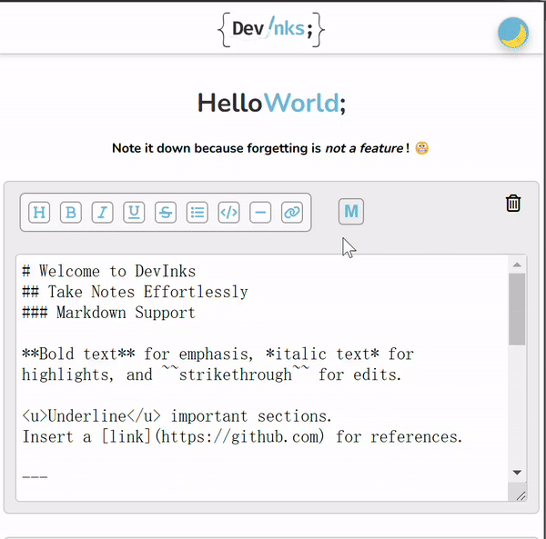
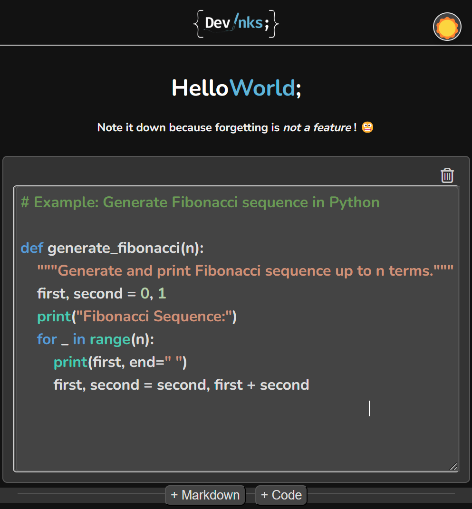
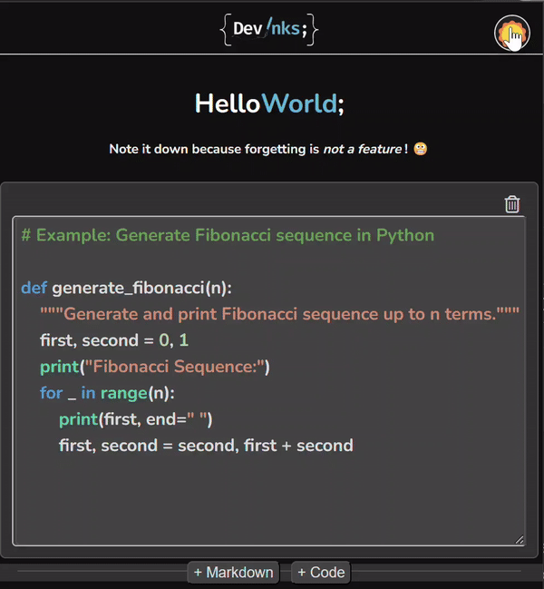

# DevInks Chrome Extension


DevInks is a Chrome extension that allows you to take rich markdown notes and code snippets directly on any webpage. The extension supports both dark mode and light mode, provides a user-friendly Markdown toolbar, and preserves note states between sessions—ensuring your notes are always there when you need them.

## Features

- **Markdown Support**:  
  Create and edit notes with full Markdown support. A dedicated Markdown toolbar helps you quickly insert headings, bold text, italics, strikethrough, underline, code blocks, and more.

- **Markdown/Rendered Toggle**:  
Easily switch between raw markdown editing and rendered markdown preview. When rendered, the Markdown toolbar is hidden for a distraction-free reading experience.



- **Code Snippets with Syntax Highlighting**:  
  Add code cells to your notes. The code editor supports syntax highlighting, making it easy to read and maintain code snippets directly within your notes.


- **Dark Mode Compatibility**:  
  The extension automatically respects system-level dark mode preferences. A toggle button also lets you manually switch between light and dark modes, providing a comfortable writing environment for any lighting condition.



- **Keyboard Shortcuts**:  
  Speed up your workflow with keyboard shortcuts for common formatting actions (e.g., `Ctrl+B`/`⌘B` for bold, `Ctrl+I`/`⌘I` for italic, and so forth), without interfering with standard browser shortcuts like copy and paste.

- **Persistent Notes**:  
  Notes are saved and persisted using IndexDB. Even after you close the extension or restart your browser, your notes remain intact.

## Installation

### From the Chrome Web Store
1. Go to the [DevInks Chrome Web Store page](https://chrome.google.com/webstore).
2. Click on **"Add to Chrome"**.
3. Confirm the installation.

### Manual Installation
1. **Clone or Download the Repository**:
   ```bash
   git clone https://github.com/your-username/devinks.git
   ```
   
2. **Load the Extension in Chrome**:
   - Open `chrome://extensions` in your Chrome browser.
   - Enable **Developer mode** (toggle in the top right corner).
   - Click on **"Load unpacked"** and select the `devinks` folder from your local machine.

3. **Access the Extension**:
   - The extension’s icon will appear in your Chrome toolbar.
   - Pin it for quick access if desired.


## Usage

1. **Open the Extension**:  
   Click the extension’s icon to open DevInks on the current webpage.

2. **Add and Edit Notes**:
   - Click on **"+ Markdown"** or **"+ Code"** to create new notes.
   - For Markdown cells: type in markdown, toggle between raw and rendered view.
   - For Code cells: enjoy syntax highlighting, indentation support, and easily read code snippets directly in your notes.

3. **Markdown Toolbar**:
   - Insert headings, bold, italic, underline, strikethrough text, code blocks, horizontal rules, and links using the toolbar buttons.
   - Hover over the toolbar buttons to see their tooltips, or use keyboard shortcuts for faster editing.

4. **Dark Mode Toggle**:
   - A circular toggle button appears in the corner of the note container.
   - Click it to switch between light and dark themes.
   - The extension also respects your system-level dark mode preference.

5. **Preservation of State**:
   - Close the extension and reopen it later; your notes and their states remain as you left them.
   - Markdown cells that were rendered will return in rendered form. Code cells and their syntax highlighting remain intact.

## Keyboard Shortcuts (Examples)

- `Ctrl+B` / `⌘B`: Bold text  
- `Ctrl+I` / `⌘I`: Italic text  
- `Ctrl+U` / `⌘U`: Underline text  
- `Ctrl+Shift+S` / `⌘Shift+S`: Strikethrough text  
- `Ctrl+L` / `⌘L`: Insert a list  
- `Ctrl+H` / `⌘H`: Insert a horizontal rule  
- `Ctrl+K` / `⌘K`: Insert a link

## Contributing

1. Fork the repository and create a new branch for your feature or bug fix.
2. Commit changes with clear and descriptive commit messages.
3. Open a pull request for review.

## License

This project is released under the [MIT License](LICENSE).

---

With DevInks, you can effortlessly organize your thoughts, code samples, and reminders, all accessible with a single click in Chrome!
