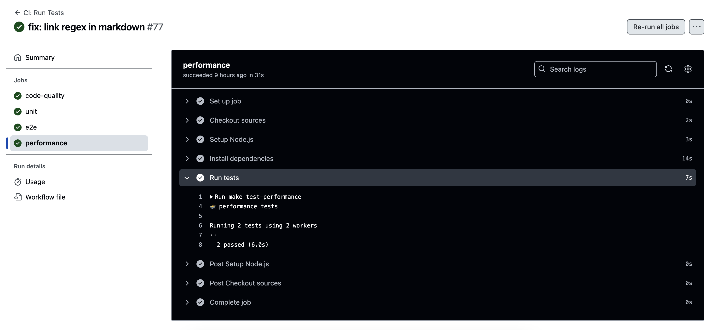
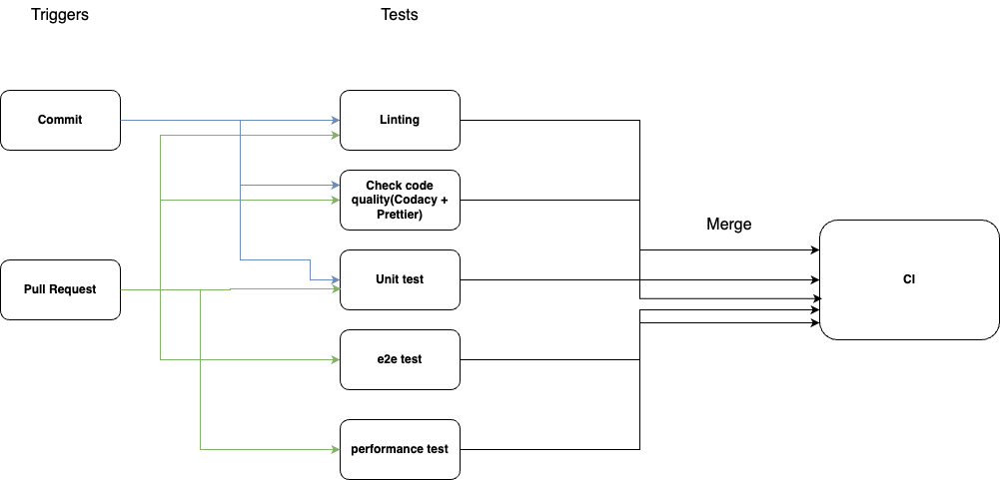

# CI Pipeline

This document provides a status update on the current state of the Continuous Integration (CI) pipeline. The pipeline is evolving with various stages implemented and others planned for future phases. Below is an overview of the currently functional pipeline components, as well as the features in progress or planned.

## Functional Pipeline Components

### 1. **Linting**  

Currently, linting is applied to pull requests (PRs) for both the PR title and code.

- **Code Linting:** Tools like **ESLint** and **Prettier** are integrated into the CI pipeline and development environments to enforce consistent coding standards.
- **PR Title Linting:** Ensures standardized naming conventions for pull requests.
Below is the current linting frame in our repository.

### 2. **Code Quality via Automation**

Our repository integrates with **Codacy**, which provides automated code quality checks and insights, such as:

- Identifying maintainability issues.
- Highlighting code complexity or duplication.
- Providing actionable feedback on coding standards and potential bugs.

Codacy is integrated via GitHub Actions to ensure real-time feedback on every PR.
Below is the current code quality checking component in our repository.

### 3. **Human Code Review (via Pull Requests)**

 Every change submitted via a pull request undergoes peer review. Reviewers check for:

- Correctness.
- Adherence to best practices.
- Code clarity and maintainability.

This ensures a robust and collaborative codebase.

### 4. **Unit Testing via Automation**

Automated unit tests are crucial for maintaining a stable codebase. Our repository uses **Jest** for JavaScript and **Mocha/Chai** for broader testing needs.

- Unit tests are triggered automatically during PR submissions or code pushes.
- These tests ensure that individual components of the code work as expected.

Below is the current unit tests in our repository.

### 5. **End-to-End Testing (E2E)**

End-to-end testing has been implemented using **Cypress** and **Playwright**. These tests simulate real user behavior and interactions with the application to ensure that all parts of the system work together correctly. The E2E tests are automated in the pipeline, running with each PR to verify that the application functions as expected from a user's perspective.
Below is the current e2e tests in our repository.

### 6. **Performance Testing**

Performance testing ensures the repository's codebase meets scalability and efficiency requirements under various workloads. This testing stage evaluates metrics such as response time, throughput, and resource utilization.

- Performance tests are triggered automatically during PR submissions or specific performance-related code changes.
- Tools like **Apache JMeter** or **Locust** are used to simulate user traffic and analyze performance bottlenecks.

Below are the key performance metrics evaluated in our repository.

## Works can be done in the future

### 1. **Documentation Generation**

We plan to integrate documentation generation into the pipeline. Tools like **JSDoc** will be used to automatically generate documentation based on the code. This will keep the project’s documentation up to date with minimal manual effort.

### 2. **Code Coverage Reporting**

To enhance test reliability, we will integrate code coverage tools, such as **Codecov** or **Coveralls**, to:

- Monitor the percentage of code covered by tests.
- Highlight untested areas.

### 3. **Deployment Pipeline (CD)**

While currently focused on CI, future iterations will include Continuous Deployment (CD) for automatic deployment to a staging or production environment.

## Diagram: CI Pipeline Overview

Below is the current diagram representing the stages of the CI pipeline, highlighting the functional components and showing where future enhancements are planned.

## Conclusion

The CI pipeline is evolving steadily with key features already in place to ensure high code quality, efficient testing, and thorough human review. As the pipeline grows, additional steps for code coverage, packaging, and documentation generation will be implemented to further enhance the development workflow.
